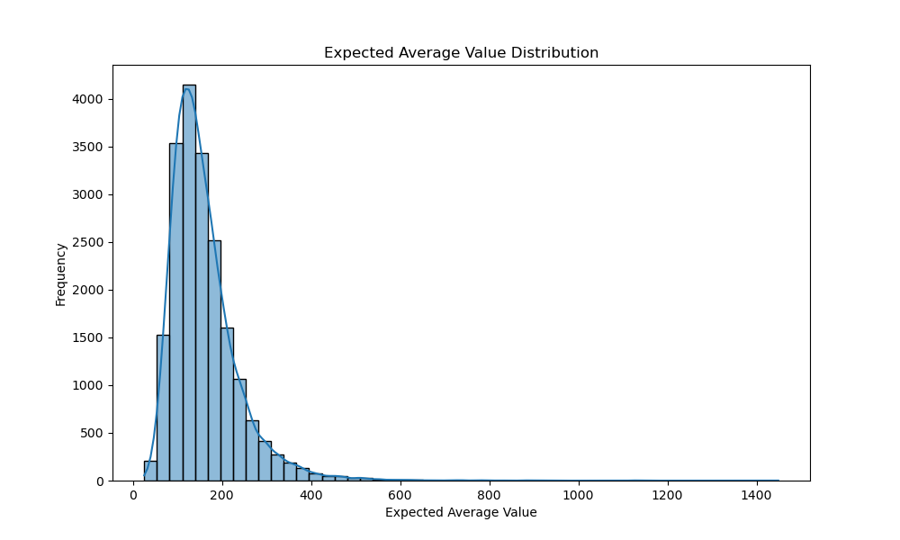

# Customer Lifetime Value (CLTV) Analysis Report

## 1. CLTV Distribution

This graph shows the overall distribution of Customer Lifetime Values. It helps us understand the number and density of customers with different CLTV values.

## 2. CLTV Distribution by Segment

This visual compares the CLTV distributions of different customer segments. It is useful for understanding the CLTV profile of each segment and seeing differences between segments.

## 3. Expected Sales Distribution (3 Months and 6 Months)

This graph compares the expected sales distributions for the next 3 months and 6 months. It allows us to see and compare short-term and medium-term sales forecasts.

## 4. Expected Average Value Distribution

This visual shows the distribution of customers' expected average spending values. It helps us understand the average revenue expectation per customer.

## 5. Customer Distribution by CLTV Segment

This graph shows how customers are distributed across different CLTV segments. It allows us to understand which segments are larger or smaller.

## 6. Average Spending by CLTV Segment

This visual compares the average spending amounts of customers in each CLTV segment. It allows us to see which segments have higher or lower spending.

## 7. Expected Sales by CLTV Segment (6 Months)

This graph shows the expected sales from each CLTV segment for the next 6 months. It helps us predict which segments will generate more revenue in the future.

## 8. Number of Customers and Total CLTV by Segment

This visual compares the number of customers in each segment and the total CLTV of these segments. It allows us to understand the relationship between segment size and value.

## 9. Recency and Frequency by CLTV Segment

This graph shows the relationship between shopping recency (time since last purchase) and frequency (shopping frequency) of customers in different CLTV segments. It helps us understand behavioral differences between segments.
